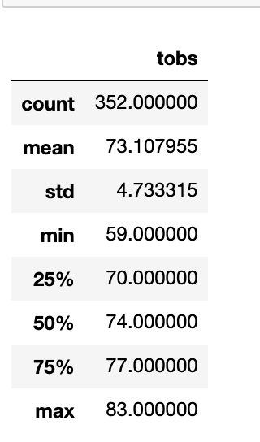
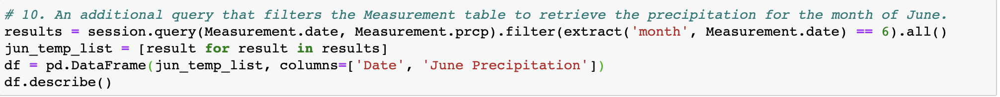
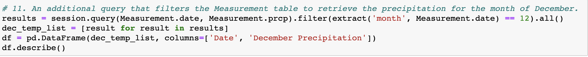
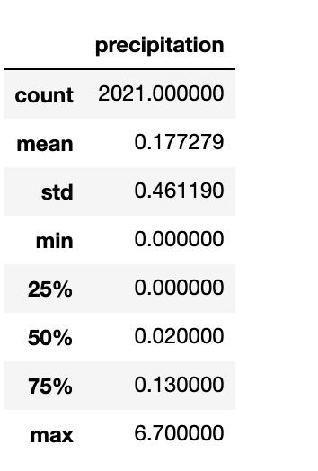

# Surf's Up Analysis

## Overview of the analysis Surf's Up Analysis

The purpose of this analysis is:
* To gather the temperature data and statistics for the months of June and December in Oahu; and
* To determine if the surf and ice cream shop business is sustainable year-round.

## Results

### The three key differences between June and December analysis:

#### 1. Minimum Temperature :
The minimum recorded temperature between the years 2010-2017 in the month of June is **64** and December is **56**.
There is quite a difference between the minumum temperature in the month of June and December.

#### 2. Maximum Temperature :
The maximum recorded temperature between the years 2010-2017 in the month of June is **85** and December is **83**.
There is not much of a difference between the maximum temperatures in the month of June and December.
It is inline with the previous years maximum temperature of **83**.

#### 3. Average/Mean Temperature :
The average temperature between the years 2010-2017 in the month of June is **74** and December is **71**.
There is not a huge difference between the average temperatures in the month of June and December.

*The difference between the **temperature** statisics in the month of **June** and **December** can be found below:*

   .         

*Previous year temperature statistics :*

   
   

## Summary

### 1. Summary based on temperature :
* Last years minimum temperature **59** is somewhere in the middle of the June and December minimum temperature.
* Last years maximum temerature **83** is right where the temperatures of June and December maximum temperature is.
* Last years average temperature **73** is close to the average temperatures of June and December.

This implies that the temperatures in Oahu is pretty stable year around and perfect for surfing and ice-cream shop business.

### 2. Summary based on precipitation :
* Additional queries that filters out precipitation for the month of June and December will help determine the level of rain in the two months.

#### Query to extract precipitation for June month

#### Query to extract precipitation for December month

* Month of June has a perfect precipitation level.
* Month of December has precipitation level comparable to previous years precipitations statistics.

The difference between the **precipitation** statisics in the month of **June** and **December** can be found below:*

 .         

*Previous year precipitation statistics :*

 

This implies that the precipitation level in Oahu is pretty stable year around and perfect for surfing and ice-cream shop business.

