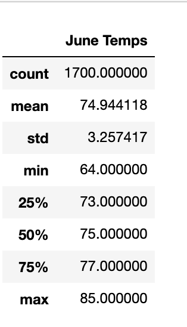

# surfs_up Analysis

## Overview of the analysis Surf's Up Analysis

The purpose of this analysis is:
* To gather the temperature data and statistics for the months of June and December in Oahu; and
* To determine if the surf and ice cream shop business is sustainable year-round.

## Results

### The three key differences between June and December analysis:

#### 1. Minimum Temperature :
The minimum recorded temperature in the month of June and December between the years 2010-2017 is **64** and **56** respectively. 
There is quite a difference between the minumum temperature in the month of June and December.

#### 2. Maximum Temperature :
The maximum recorded temperature in the month of June and December between the years 2010-2017 is **85** and **83** respectively. 
There is not much of a difference between the maximum temperatures in the month of June and December.

#### 3. Average/Mean Temperature :
The average temperature in the month of June and December between the years 2010-2017 is **74** and **71** respectively. 
There is not a huge difference between the average temperatures in the month of June and December.

*The difference between the **temperature** statisics in the month of **June** and **December** can be found below:*

   .         

## Summary

Summary: Provide a high-level summary of the results and two additional queries that you would perform to gather more weather data for June and December.

There is a high-level summary of the results and there are two additional queries to perform to gather more weather data for June and December. (5 pt)

*The difference between the **precipitation** statisics in the month of **June** and **December** can be found below:*

 .         

